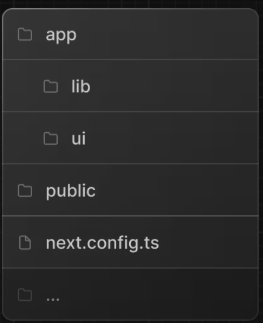
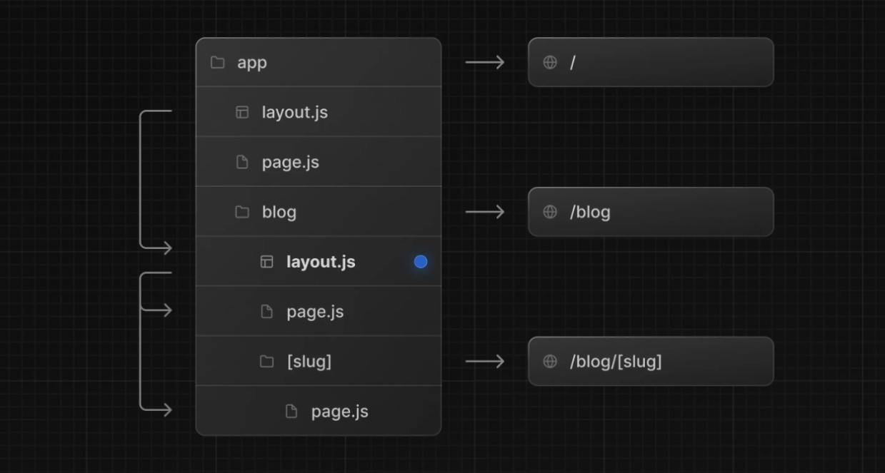
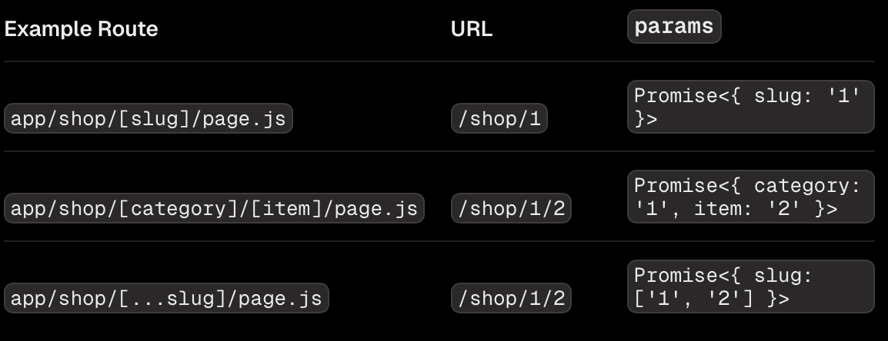
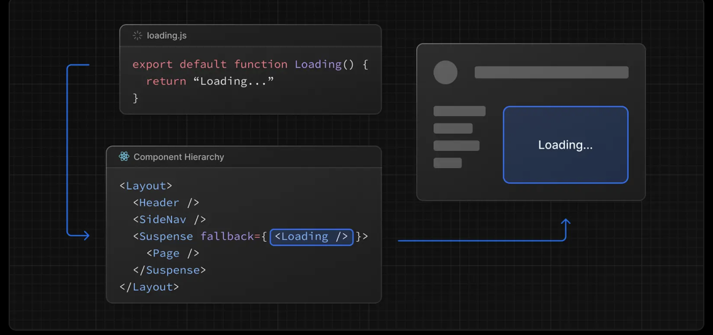

# NextJS-Vercel-Dashboard
This project is follow the instruction in NextJS Vercel Dashboard document

ref: [NextJs](https://nextjs.org/learn/dashboard-app/getting-started)

# Introduction

# Setup Nextjs
## How to?
NextJs recommend us to use **pnpm** to install and create NextJs project. Here is how we install **pnpm**

```bash
$ npm install -g pnpm
```

After successfully install **pnpm** we pull the **Dashboard** project from github. In this tutorial we use the pre-written code from NextJs.

```bash
npx create-next-app@latest nextjs-dashboard --example "https://github.com/vercel/next-learn/tree/main/dashboard/starter-example" --use-pnpm
```

## Explore the project
First we look at the project structure. 

```bash
$ cd nextjs-dashboard
```

Inside we can see folder **app** and **public**. App contain the main source code and public stores the pictures that using for this tutorial.

Inside the **app** we have these folders:



Here is the explaination of the folders according to NextJS

* /app: Contains all the routes, components, and logic for your application, this is where you'll be mostly working from.
* /app/lib: Contains functions used in your application, such as reusable utility functions and data fetching functions.
* /app/ui: Contains all the UI components for your application, such as cards, tables, and forms. To save time, we've pre-styled these components for you.
*/public: Contains all the static assets for your application, such as images.
* Config Files: You'll also notice config files such as next.config.ts at the root of your application. Most of these files are created and pre-configured when you start a new project using create-next-app. You will not need to modify them in this course.

## How to run the project
To run the project first use this command line to install all the package need
```bash
$ pnpm i
```
then
```bash
pnpm dev
```
to run the project.

## Layout and Page
* In NextJS, they use file-base routing, each page.tsx is a route, so we use folders and page to define the routing in our project. 
* Unlike page, layout is the UI that shared between pages. UI keep state and do not re-render.

### Create a page
* To creata a page just simply create a folder, for instance **dashboard** inside app
```bash
$ mkdir dashboard
```
then
```bash
$ cd dashboard
```
and create page.tsx
```bash
$ touch page.tsx
```
And just like that we have the dashboard page.
```
https:localhost:3000/dashboard
```

### Create a layout
* To create layout, same with page.tsx, we create a layout inside the folder we want. Normally it is the parent folder that will need a UI to shared accross its child.

```bash
$ touch /dashboard/layout.tsx
```

### Create a Nested Route
A nested route is a route with many URL level. For example ***/blog/[slug]*** contains:
* ***"/"*** : Root Segment
* ***"blog"***: Segment
* ***"[slug]"***: leaf Segment

In nextjs:
* A folder is defined as a segment map with URL
* Files like page.tsx and layout.tsx is the UI shown for that URL segment.

### Create Nested Layout
By default the layout page wrap around ***children*** prop. You can nest layout by adding layout inside specific route. For example:



```tsx
export default function BlogLayout({
  children,
}: {
  children: React.ReactNode
}) {
  return <section>{children}</section>
}
```

If you were to combine the two layouts above, the root layout ***(app/layout.js)*** would wrap the blog layout (app/blog/layout.js), which would wrap the blog (app/blog/page.js) and blog post page (app/blog/[slug]/page.js).

### Create Dynamic Segment
Dynamic Segment use when you want to pass a parameter to the URL. For example, instead of creater many different URL for each blog post, you can pass a data and generate the route base on it.
* To create ***Dynamic Segment*** you wrap the segment in ***[]***.

* For instance ***app/blog/[slug]/page.tsx*** :
```tsx
export default async function BlogPostPage({
  params,
}: {
  params: Promise<{ slug: string }>
}) {
  const { slug } = await params
  const post = await getPost(slug)
 
  return (
    <div>
      <h1>{post.title}</h1>
      <p>{post.content}</p>
    </div>
  )
}
```

#### Param
Param is a props that promise resolves to an object containing in the dynamic route from root segment down to that page.

* Example Routes:


***Param*** prop is a promise, we muse use ***async/await***

### Rendering with search params

### Linking between pages
You can use ***Link*** component to navigate between routes. Tag Link is a built-in Next.js extend from HTML tag ***a***.

```tsx
import Link from 'next/link'
import { getPosts } from '@/lib/posts'
 
export default async function Posts() {
  const posts = await getPosts()
 
  return (
    <ul>
      {posts.map((post) => (
        <li key={post.slug}>
          <Link href={`/blog/${post.slug}`}>{post.title}</Link>
        </li>
      ))}
    </ul>
  )
}
```

### Route Props Helpers

## Linking and Navigating
In Nextjs, routes are rendered on the server by default. Client has to wait for a server response before a new route appear. Nextjs offers built-in prefetching, streamin and client-side transitions make sure navigation fast and responsive.

* These are the concepts need to familiar fo understand navigation:
  * Server Rendering
  * Prefetching
  * Streaming
  * Client-side transitions

### Server Rendering
By default in Nextjs, ***Layout*** and ***Pages*** are React Server Component, which means the UI is load in the server before sent to the client. Below we will discuss when the UI is render in Server.

* There are 2 types of ***Server Rendering***:
  * ***Prerendering*** happens at build time(run the project) or during the [revalidation](https://nextjs.org/docs/app/getting-started/revalidating) and the result is cached.
  * Dynamic Rendering happens at request time in response to client request.

#### Prefetching
Prefetching is the process when browser decide which navigation to fetch before the user click the to navigate. For example:

```tsx
import Link from 'next/link'
 
export default function Layout({ children }: { children: React.ReactNode }) {
  return (
    <html>
      <body>
        <nav>
          {/* Prefetched when the link is hovered or enters the viewport */}
          <Link href="/blog">Blog</Link>
          {/* No prefetching */}
          <a href="/contact">Contact</a>
        </nav>
        {children}
      </body>
    </html>
  )
}
```

Nextjs in client-side will prefer prefetch the ***Link** over the ***a***.

* Static Route will do the full prefetch
* Dynamic Route will skill prefetch or partially prefetch if we have the ***loading.tsx*** page.

#### Streaming
Streaming allows server to send parts of dynamic route to browser instead of waiting the whole page to finish.

* For dynamic routes, it means they can be ***partially prefetched***.

* To use streaming just create a ***loading.tsx***

app/dashboard/loading.tsx
```tsx
export default function Loading() {
  // Add fallback UI that will be shown while the route is loading.
  return <LoadingSkeleton />
}
```
NextJS will automatically wrap the page.tsx in the ***'<Suspense>'*** boundary.

Read more about Suspense: [Suspense](https://react.dev/reference/react/Suspense)

### Client-side transition
Next.js avoids this with client-side transitions using the ***Link*** component. Instead of reloading the page, it updates the content dynamically by:
* Keeping any shared layouts and UI.
* Replacing the current page with the prefetched loading state or a new page if available.

Client-side transitions are what makes a server-rendered apps feel like client-rendered apps. And when paired with prefetching and streaming, it enables fast transitions, even for dynamic routes.

Read more about what make Transition slow here: [What makes transition slow](https://nextjs.org/docs/app/getting-started/linking-and-navigating#what-can-make-transitions-slow)

## Server and Component
* Basically by default, all pages and layouts are server component.

### When to use which?
#### Client Component
Use Client Component when you need:
* State and event hanlder like ***onClick***, ***onChange***
* Lfiecyle logic, eg ***useEffect***
* Browser-only API eg ***localStorage***, ***window***, ***Navigator.geolocation***.
* Custom hooks
#### Server Component
We use Server Component when: 
* Fetch data from database or APIs close to source.
* Use API keys, tokens, and other secrets without exposing them to client
* Reduce the amount of Javascript sent to browser.
* Improve [First Contentful Paint(FCP)](https://web.dev/fcp/), and stream content progressively to the client.

The example below demonstrate the Page.tsx is a Server Component fetch data of Posts and pass it as a prop to LikeButton Component which is a client-side.

```tsx
import LikeButton from '@/app/ui/like-button'
import { getPost } from '@/lib/data'
 
export default async function Page({
  params,
}: {
  params: Promise<{ id: string }>
}) {
  // Get Posts
  const { id } = await params
  const post = await getPost(id)
 
  return (
    <div>
      <main>
        <h1>{post.title}</h1>
        {/* ... */}
        <LikeButton likes={post.likes} />
      </main>
    </div>
  )
}
```

```tsx
'use client' // This statement define this page as client-side
 
import { useState } from 'react'
 
export default function LikeButton({ likes }: { likes: number }) {
  // ...
}
```

### How do Server and Client work in NextJS
#### On the Server 
* On the server, Next.js uses React's APIs to orchestrate rendering. The rendering work is split into chunks, by individual route segments (layouts and pages), including parallel route slots whether or not they are displayed:
  * Server Components are rendered into a special data format called the React Server Component Payload (RSC Payload).
  * Client Components and the RSC Payload are used to prerender HTML.

#### On the Client
* Then, on the client:
  * HTML is used to immediately show a fast non-interactive preview of the route to the user.
  * RSC Payload is used to reconcile the Client and Server Component trees.
  * JavaScript is used to hydrate Client Components and make the application interactive.

### Few notes
* To make a page a Client-side just ***'use client'*** at the top of the page
* You can pass data from Server Component to Client Component via props. Example passing the post above.
* Context provider, the [React Context](https://react.dev/learn/passing-data-deeply-with-context) can only use in Client Component. To use Context create a client Component that accept ***children***
```tsx
'use client'
 
import { createContext } from 'react'
 
export const ThemeContext = createContext({})
 
export default function ThemeProvider({
  children,
}: {
  children: React.ReactNode
}) {
  return <ThemeContext.Provider value="dark">{children}</ThemeContext.Provider>
}
```
then import into Server Component
```tsx
import ThemeProvider from './theme-provider'
 
export default function RootLayout({
  children,
}: {
  children: React.ReactNode
}) {
  return (
    <html>
      <body>
        <ThemeProvider>{children}</ThemeProvider>
      </body>
    </html>
  )
}
```
* Third party Component
  * When import the 3rd party that relies on client-only feature but yet doesn't have ***'use client'*** and we want to use it in the server component we need to wrap it.
  * For example, we have the ***Carousel*** imported from the ***acme-carousel***. If you use it in the Client Component then it fine.
```tsx
'use client'
 
import { useState } from 'react'
import { Carousel } from 'acme-carousel'
 
export default function Gallery() {
  const [isOpen, setIsOpen] = useState(false)
 
  return (
    <div>
      <button onClick={() => setIsOpen(true)}>View pictures</button>
      {/* Works, since Carousel is used within a Client Component */}
      {isOpen && <Carousel />}
    </div>
  )
}
```

It work inside another 'use client' component. But not the Server Component, here is how we fix it
```tsx
'use client'
 
import { Carousel } from 'acme-carousel'
 
export default Carousel
```
now we can use inside the Server Component
```tsx
import Carousel from './carousel'
 
export default function Page() {
  return (
    <div>
      <p>View pictures</p>
      {/*  Works, since Carousel is a Client Component */}
      <Carousel />
    </div>
  )
}
```

## Fetching Data

### Server Components

* In Server Component we can fetch data using any asynchronus I/O like:
  * fetch API
  * ORM or Database

#### Fetch API
* To fetch API, turn your fetch into a asynchronus function and await fetch call.

```tsx
export default async function Page() {
  const data = await fetch('https://api.vercel.app/blog')
  const posts = await data.json()
  return (
    <ul>
      {posts.map((post) => (
        <li key={post.id}>{post.title}</li>
      ))}
    </ul>
  )
}
```

#### With ORM or Database
* Since Server Components are rendered on the server, credentials and query logic will not be included in the client bundle so you can safely make database queries using an ORM or database client.
```tsx
import { db, posts } from '@/lib/db'
 
export default async function Page() {
  const allPosts = await db.select().from(posts)
  return (
    <ul>
      {allPosts.map((post) => (
        <li key={post.id}>{post.title}</li>
      ))}
    </ul>
  )
}
```

#### Streaming
* When data is fetched, it will be rendered on Server Component and sent to browser like we discussed above. If data is slow to fetch it will take long time to have a full UI. That's why we use ***Streaming*** to divide the UI into ***chunks***. The fast data can display first and the slower can display later.

##### Streaming with ***loading.tsx***
* We create ***loading.tsx*** file inside the folder we want to stream while the data is being fetched.

```tsx
export default function Loading() {
  // Define the Loading UI here
  return <div>Loading...</div>
}
```
* On navigation, the user will see the **loading state** of the page being render. 
* Behind the scene, the **loading** page will automatically wrap the ***page.tsx** file and any children below the ***'Suspense'*** boundary



* This make a block navigation which have to wait until the layout finishes rendering. To fix this we use ***Suspense*** boundary with a fallback.
* This is why, while loading.js works well for streaming route segments, using Suspense closer to the runtime or uncached data access is recommended.

##### With ***Suspense***
* ***Suspense*** allows you to be more granular about what parts of the page you want to stream.

```tsx
import { Suspense } from 'react'
import BlogList from '@/components/BlogList'
import BlogListSkeleton from '@/components/BlogListSkeleton'
 
export default function BlogPage() {
  return (
    <div>
      {/* This content will be sent to the client immediately */}
      <header>
        <h1>Welcome to the Blog</h1>
        <p>Read the latest posts below.</p>
      </header>
      <main>
        {/* If there's any dynamic content inside this boundary, it will be streamed in */}
        <Suspense fallback={<BlogListSkeleton />}>
          <BlogList />
        </Suspense>
      </main>
    </div>
  )
}
```

* You can show anything outside the boundary and stream the list of components you need to stream inside the boundary


* For best user experience, we recommend designing the loading states that are meaningful and help user to understand the app is responding.

#### Client components
* There are 2 ways to fetch data in Client Components, using:
  * React ***use*** API 
  * A community library like SWR or React Query

##### Streaming data with the ***use*** API
* Start by fetch data inside your Server Component and pass a promise to your Client Component as prop:
```tsx
import Posts from '@/app/ui/posts'
import { Suspense } from 'react'
 
export default function Page() {
  // Don't await the data fetching function
  const posts = getPosts()
 
  return (
    <Suspense fallback={<div>Loading...</div>}>
      <Posts posts={posts} />
    </Suspense>
  )
}
```

* In your Client Component use the ***use*** API to read the promise:
```tsx
'use client'
import { use } from 'react'
 
export default function Posts({
  posts,
}: {
  posts: Promise<{ id: string; title: string }[]>
}) {
  const allPosts = use(posts)
 
  return (
    <ul>
      {allPosts.map((post) => (
        <li key={post.id}>{post.title}</li>
      ))}
    </ul>
  )
}
```

##### Using Community Libraries
* You can use library like [SWR](https://swr.vercel.app/) or [React Query](https://tanstack.com/query/latest) to fetch data in CLient Component.

```tsx
'use client'
import useSWR from 'swr'
 
const fetcher = (url) => fetch(url).then((r) => r.json())
 
export default function BlogPage() {
  const { data, error, isLoading } = useSWR(
    'https://api.vercel.app/blog',
    fetcher
  )
 
  if (isLoading) return <div>Loading...</div>
  if (error) return <div>Error: {error.message}</div>
 
  return (
    <ul>
      {data.map((post: { id: string; title: string }) => (
        <li key={post.id}>{post.title}</li>
      ))}
    </ul>
  )
}
```

#### Sequential Data Fetching
* Sequential data fetching happens when one request depends on data from another.
```tsx
export default async function Page({
  params,
}: {
  params: Promise<{ username: string }>
}) {
  const { username } = await params
  // Get artist information
  const artist = await getArtist(username)
 
  return (
    <>
      <h1>{artist.name}</h1>
      {/* Show fallback UI while the Playlists component is loading */}
      <Suspense fallback={<div>Loading...</div>}>
        {/* Pass the artist ID to the Playlists component */}
        <Playlists artistID={artist.id} />
      </Suspense>
    </>
  )
}
 
async function Playlists({ artistID }: { artistID: string }) {
  // Use the artist ID to fetch playlists
  const playlists = await getArtistPlaylists(artistID)
 
  return (
    <ul>
      {playlists.map((playlist) => (
        <li key={playlist.id}>{playlist.name}</li>
      ))}
    </ul>
  )
}
```
* In this example, <Suspense> allows the playlists to stream in after the artist data loads. However, the page still waits for the artist data before displaying anything. To prevent this, you can wrap the entire page component in a <Suspense> boundary (for example, using a loading.js file) to show a loading state immediately.

#### Parallel data fetching
* Parallel data fetching happens when data requests in a route are eagerly initiated and start at the same time.

* However, within any component, multiple async/await requests can still sequential if placed after the other.

```tsx
import { getArtist, getAlbums } from '@/app/lib/data'
 
export default async function Page({ params }) {
  // These requests will be sequential
  const { username } = await params
  const artist = await getArtist(username)
  const albums = await getAlbums(username)
  return <div>{artist.name}</div>
}
```
Start multiple request by calling ***fetch***, then await them with ***Promise.all***. Request begin as soon as ***fetch*** is called.

```tsx
import Albums from './albums'
 
async function getArtist(username: string) {
  const res = await fetch(`https://api.example.com/artist/${username}`)
  return res.json()
}
 
async function getAlbums(username: string) {
  const res = await fetch(`https://api.example.com/artist/${username}/albums`)
  return res.json()
}
 
export default async function Page({
  params,
}: {
  params: Promise<{ username: string }>
}) {
  const { username } = await params
 
  // Initiate requests
  const artistData = getArtist(username)
  const albumsData = getAlbums(username)
 
  const [artist, albums] = await Promise.all([artistData, albumsData])
 
  return (
    <>
      <h1>{artist.name}</h1>
      <Albums list={albums} />
    </>
  )
}
```

#### Reusing dta with ***React.cache***
* Wrap a data-fetching funciton in [React.cache](https://react.dev/reference/react/cache) so multiple component in the same request share on result instead of refetching:
```tsx
import { cache } from 'react'
 
export const getUser = cache(async () => {
  const res = await fetch('https://api.example.com/user')
  return res.json()
})
```


```tsx
import { getUser } from '../lib/user'
 
export default async function DashboardPage() {
  const user = await getUser() // Cached - same request, no duplicate fetch
  return <h1>Dashboard for {user.name}</h1>
}
```
* Since getUser is wrapped with React.cache, multiple calls within the same request return the same memoized result, whether called directly in Server Components or resolved via context in Client Components.

## Mutating Data


### Creating Server Functions
* ***use server*** directive use to define a function as Server Function. You can place at the top of an Asynchronus funtion or at the separate file to mark all exports of that file.
```tsx
import { auth } from '@/lib/auth'
 
export async function createPost(formData: FormData) {
  'use server'
  const session = await auth()
  if (!session?.user) {
    throw new Error('Unauthorized')
  }
 
  const title = formData.get('title')
  const content = formData.get('content')
 
  // Mutate data
  // Revalidate cache
}
 
export async function deletePost(formData: FormData) {
  'use server'
  const session = await auth()
  if (!session?.user) {
    throw new Error('Unauthorized')
  }
 
  const id = formData.get('id')
 
  // Verify the user owns this resource before deleting
  // Mutate data
  // Revalidate cache
}

```

#### Server Components
Server Functions can be inlined in Server Components by adding the ***use server*** directive to the top of the function body:
```tsx
export default function Page() {
  // Server Action
  async function createPost(formData: FormData) {
    'use server'
    // ...
  }
 
  return <></>
}
```

#### Client Components
* It is not possible to define Server Function inside a Client Component.
```tsx
'use server'
 
export async function createPost() {}
```

```tsx
'use client'
 
import { createPost } from '@/app/actions'
 
export function Button() {
  return <button formAction={createPost}>Create</button>
}
```
* But you can import a ***Server Function** to a ***Client Component***.

#### Passing actions as props
* You can also pass an action to Client Component as prop:
```tsx
'use client'
 
export default function ClientComponent({
  updateItemAction,
}: {
  updateItemAction: (formData: FormData) => void
}) {
  return <form action={updateItemAction}>{/* ... */}</form>
}
```

### Invoking Server Functions
* There are 2 ways to invoke a ***Server Function***
  * Forms
  * Event Handlers and useEffect in ***Client Components***

#### Forms
* React extends HTML ***form*** element to allow Server Function to pass inside the ***action*** prop.
```tsx
import { createPost } from '@/app/actions'
 
export function Form() {
  return (
    <form action={createPost}>
      <input type="text" name="title" />
      <input type="text" name="content" />
      <button type="submit">Create</button>
    </form>
  )
}
```

```tsx
'use server'
 
import { auth } from '@/lib/auth'
 
export async function createPost(formData: FormData) {
  const session = await auth()
  if (!session?.user) {
    throw new Error('Unauthorized')
  }
 
  const title = formData.get('title')
  const content = formData.get('content')
 
  // Mutate data
  // Revalidate cache
}
```

#### Event Handlers
* You can invoke a Server Function in onClick() events handler(or any events handler) in a Client Component.
```tsx
'use client'
 
import { incrementLike } from './actions'
import { useState } from 'react'
 
export default function LikeButton({ initialLikes }: { initialLikes: number }) {
  const [likes, setLikes] = useState(initialLikes)
 
  return (
    <>
      <p>Total Likes: {likes}</p>
      <button
        onClick={async () => {
          const updatedLikes = await incrementLike()
          setLikes(updatedLikes)
        }}
      >
        Like
      </button>
    </>
  )
}
```

#### Showing a pending state
* We can use React ***useActionState*** hook to return pending boolean.
```tsx
'use client'
 
import { useActionState, startTransition } from 'react'
import { createPost } from '@/app/actions'
import { LoadingSpinner } from '@/app/ui/loading-spinner'
 
export function Button() {
  const [state, action, pending] = useActionState(createPost, false)
 
  return (
    <button onClick={() => startTransition(action)}>
      {pending ? <LoadingSpinner /> : 'Create Post'}
    </button>
  )
}
```

#### Refresh data
* After mutation, you can refresh the page to display the latest data by calling ***refresh*** from ***next/cache*** in Server Action:

```tsx
'use server'
 
import { auth } from '@/lib/auth'
import { refresh } from 'next/cache'
 
export async function updatePost(formData: FormData) {
  const session = await auth()
  if (!session?.user) {
    throw new Error('Unauthorized')
  }
  // Mutate data
  // ...
 
  refresh()
}
```

#### Revalidate Data
* After performing a mutation, you can revalidate the Nextjs.cache and show the updated data by calling [revalidatePath](https://nextjs.org/docs/app/api-reference/functions/revalidatePath) or [revalidateTag](https://nextjs.org/docs/app/api-reference/functions/revalidateTag) withing Server Function:

```tsx
import { auth } from '@/lib/auth'
import { revalidatePath } from 'next/cache'
 
export async function createPost(formData: FormData) {
  'use server'
  const session = await auth()
  if (!session?.user) {
    throw new Error('Unauthorized')
  }
  // Mutate data
  // ...
 
  revalidatePath('/posts')
}
```

#### Redirect after a mutation
```tsx
'use server'
 
import { auth } from '@/lib/auth'
import { revalidatePath } from 'next/cache'
import { redirect } from 'next/navigation'
 
export async function createPost(formData: FormData) {
  const session = await auth()
  if (!session?.user) {
    throw new Error('Unauthorized')
  }
  // Mutate data
  // ...
 
  revalidatePath('/posts')
  redirect('/posts')
}
```

## Error Handling
* There are 2 types of error: ***Expected Error*** and ***Uncaught exceptions***. This section will help you handle these errors.

### Handling expected errors
* Expected errors are those that can occur during the normal operation of the application, such as those from server-side form validation or failed requests. These errors should be handled explicitly and returned to the client.

#### Server Function
* Instead of using ***try/catch***, the model expected errors to return values.
```tsx
'use server'
 
export async function createPost(prevState: any, formData: FormData) {
  const title = formData.get('title')
  const content = formData.get('content')
 
  const res = await fetch('https://api.vercel.app/posts', {
    method: 'POST',
    body: { title, content },
  })
  const json = await res.json()
 
  if (!res.ok) {
    return { message: 'Failed to create post' }
  }
}
```

* You can pass action to the ***useActionState*** hook and use the returned state to display an error message.

```tsx
'use client'
 
import { useActionState } from 'react'
import { createPost } from '@/app/actions'
 
const initialState = {
  message: '',
}
 
export function Form() {
  const [state, formAction, pending] = useActionState(createPost, initialState)
 
  return (
    <form action={formAction}>
      <label htmlFor="title">Title</label>
      <input type="text" id="title" name="title" required />
      <label htmlFor="content">Content</label>
      <textarea id="content" name="content" required />
      {state?.message && <p aria-live="polite">{state.message}</p>}
      <button disabled={pending}>Create Post</button>
    </form>
  )
}
```
#### Server Component
* When fetching data inside of a Server Component, you can use the response to conditionally render an error message or redirect.
```tsx
export default async function Page() {
  const res = await fetch(`https://...`)
  const data = await res.json()
 
  if (!res.ok) {
    return 'There was an error.'
  }
 
  return '...'
}
```

#### Not Found
* You can use ***notFound*** function within the route segment and use ***notFound.tsx*** to show ***404*** UI.
```tsx
import { notFound } from 'next/navigation'
import { getPostBySlug } from '@/lib/posts'
 
export default async function Page({
  params,
}: {
  params: Promise<{ slug: string }>
}) {
  const { slug } = await params
  const post = getPostBySlug(slug)
 
  if (!post) {
    notFound()
  }
 
  return <div>{post.title}</div>
}
```

```tsx
export default function NotFound() {
  return <div>404 - Page Not Found</div>
}
```

### Handling uncaught exceptions
* Uncaught exceptions are unexpected errors that indicate bugs or issues that should not occur during the normal flow of your application. These should be handled by throwing errors, which will then be caught by error boundaries.

#### Nested error boundaries
* Create a Error boundaries to help catch errors in the child component instead of crash the component tree.
* Here is an example of ***error.tsx***. If any error occur in the nested component, this UI will appear.
```tsx
'use client' // Error boundaries must be Client Components
 
import { useEffect } from 'react'
 
export default function ErrorPage({
  error,
  retry,
}: {
  error: Error & { digest?: string }
  retry: () => void
}) {
  useEffect(() => {
    // Log the error to an error reporting service
    console.error(error)
  }, [error])
 
  return (
    <div>
      <h2>Something went wrong!</h2>
      <button
        onClick={
          // Attempt to recover by re-fetching and re-rendering the segment
          () => retry()
        }
      >
        Try again
      </button>
    </div>
  )
}
```

* For component-level error recovery, the catchError function lets you create error boundaries that can wrap any part of your component tree:

```tsx
'use client'
 
import { catchError, type ErrorInfo } from 'next/error'
 
function ErrorFallback(props: { title: string }, { error, retry }: ErrorInfo) {
  return (
    <div>
      <h2>{props.title}</h2>
      <p>{error.message}</p>
      <button onClick={() => retry()}>Try again</button>
    </div>
  )
}
 
export default catchError(ErrorFallback)
```

* Then use the returned component as a wrapper in any layout or page:
```tsx
import ErrorBoundary from './custom-error-boundary'
 
export default function Component({ children }: { children: React.ReactNode }) {
  return <ErrorBoundary title="Dashboard Error">{children}</ErrorBoundary>
}
```

* In general, errors in event handlers or async code aren’t handled by error boundaries because they run after rendering.
* To handle these cases, catch the error manually and store it using useState or useReducer, then update the UI to inform the user.

```tsx
'use client'
 
import { useState } from 'react'
 
export function Button() {
  const [error, setError] = useState(null)
 
  const handleClick = () => {
    try {
      // do some work that might fail
      throw new Error('Exception')
    } catch (reason) {
      setError(reason)
    }
  }
 
  if (error) {
    /* render fallback UI */
  }
 
  return (
    <button type="button" onClick={handleClick}>
      Click me
    </button>
  )
}
```

* Note that unhandled errors inside startTransition from useTransition, will bubble up to the nearest error boundary.

```tsx
'use client'
 
import { useTransition } from 'react'
 
export function Button() {
  const [pending, startTransition] = useTransition()
 
  const handleClick = () =>
    startTransition(() => {
      throw new Error('Exception')
    })
 
  return (
    <button type="button" onClick={handleClick}>
      Click me
    </button>
  )
}
```

#### Global Errors
* While less common, you can handle errors in the root layout using the global-error.js file, located in the root app directory, even when leveraging internationalization. Global error UI must define its own html and body tags, since it is replacing the root layout or template when active.

```tsx
'use client' // Error boundaries must be Client Components
 
export default function GlobalError({
  error,
  retry,
}: {
  error: Error & { digest?: string }
  retry: () => void
}) {
  return (
    // global-error must include html and body tags
    <html>
      <body>
        <h2>Something went wrong!</h2>
        <button onClick={() => retry()}>Try again</button>
      </body>
    </html>
  )
}
```